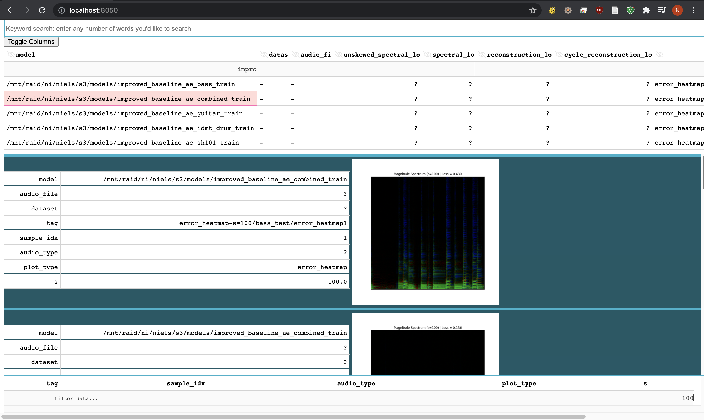

# pandas-db

A minimalistic local (meta) data store.
- save any tabular data, like model metrics. Instead of a metrics UI, you get to use jupyter to plot anything
- save artifacts with metadata, like model artifacts or training data
- browse artifacts in the UI

# Setup
```sh
# Install dependencies
pip install git+git://github.com/nielsrolf/pandas_db
```
Add `export PANDAS_DB_PATH=some/path` to your `.bashrc`.
To use the UI, define a `views.json` (for an example, see `pandas_db/views.json`) and save this file to `$PANDAS_DB_PATH/.pandas_db_views.json`.

# Saving Meta Data

```python
from pandas_db import PandasDB


db = PandasDB("some/path")
db.save(foo="foo", bar="bar")
db.save(foo="FOO", another_column=42)
df = db.get_df()
```
|                                      | foo   | bar   | pandas_db.created              |   another_column |
|:-------------------------------------|:------|:------|:---------------------------|-----------------:|
| e2bfa08f-b055-4526-b6a5-e965282e62dc | foo   | bar   | 2021-07-08 17:53:34.087882 |              nan |
| 8e99fc43-576e-4af6-8f4d-5b6ef33ee029 | FOO   | nan   | 2021-07-08 17:53:34.099407 |               42 |

Or use context managers to set default values for rows that are created within the context:
```python
from pandas_db import pandas_db

with pandas_db.set_context(foo="foo"):
    pandas_db.save(bar="bar")

# Equivalent to:
# pandas_db.save(foo="foo", bar="bar")
```

# Saving artifacts
```python
from pandas_db import pandas_db

with pandas_db.set_context(foo="foo"):
    pandas_db.save_artifact("my_file.png") 
    #  file is saved, and meta data from context is also saved like any tabular data

```

# Using the UI
If you defined your `views.json` as in the example, you can start the UI via `pandasdb {files/metrics}`.

You can edit the data in the top table and save via `ctrl+s`. The filters in the top (search bar + table filters) apply to all displayed data, the filters at the bottom apply to media files only.